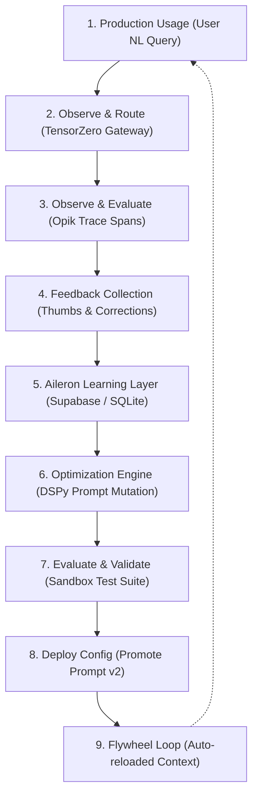

# Architectural Decisions & Core Principles

This document records the architectural standards and core principles agreed upon for all projects in Anand Muraleedharan's digital footprint. Every new feature, micro-app, or sub-module must align with these guidelines.

---

## 1. Serverless-First & No-Cost Infrastructure
* **Zero Dedicated Servers:** All projects must run on fully serverless, stateless platforms (e.g., Next.js App Router on Vercel's Hobby Tier). Avoid VMs, container hosts, or dedicated server instances.
* **Database-Free by Default:** Store state in config files, environmental variables, GitHub Actions schedules (cron), or local browser storage. Introduce relational/NoSQL databases only if dynamic multi-user persistence is strictly necessary.
* **Serverless Functions as Proxies:** If external APIs require secrets (e.g., Gemini API, Resend), route them through Next.js serverless API routes (`/api/...`) rather than calling them directly from client-side JS.

---

## 2. Micro-App Extensibility (Git Submodules)
* **Isolated Sub-directories:** Multi-page app expansions should be structured as standalone Next.js apps under the `/apps` directory.
* **Git Submodule Pattern:** Each app in the `/apps` directory is an independent git repository referenced as a submodule. This prevents dependency bloat and ensures one app's updates cannot break another.
* **Subdomain Routing:** Deploy each submodule to Vercel as a distinct project. Bind custom subdomains (e.g., `newsletter.anandmuraleedharan.com`) using CNAME records in the Spaceship DNS dashboard.
* **Unified Discovery:** The main portfolio (`anandmuraleedharan.com`) acts as the directory hub, linking out to each subdomain via clean developer playground cards.

---

## 3. Premium Aesthetics & Design Systems
* **Wow Factor:** Every visual interface must feel premium, state-of-the-art, and modern. Avoid browser-default styles or generic primary colors.
* **Design Tokens:** Use CSS variables (`globals.css`) mapped to refined color palettes (HSL-based tailoring) with support for system-preference dark and light modes.
* **Interactive Motion:** Add micro-animations, hover scaling, and smooth transition properties (`transition: all 0.3s ease`) to buttons, cards, and interactive elements.

---

## 4. LLM & API Integrations
* **Official SDKs & Platforms:** Always prefer official vendor-supported SDKs (e.g., `@google/genai` and `resend`) over custom wrappers.
* **Stateless Gateways & Observability**: Integrate production-grade tools:
  - **TensorZero**: For inference gateway routing, fallback setups, and experimentation.
  - **Opik**: For trace evaluation, spans mapping, and observability.
  - **DSPy / GEPA**: For programmatic prompt/pipeline optimization based on user feedback.
* **Free-Tier Optimization:** Optimize prompts and models to run within free-tier quotas (e.g., model fallback strategies like `gemini-2.5-flash-lite` if standard flash models exhaust developer quotas).
* **Search Grounding:** Rely on Gemini's native Search Grounding tool (`google_search`) for live web access rather than incorporating expensive third-party web scrapers.

---

## 5. Security & Scheduled Automation
* **Secured API Endpoints:** All state-modifying or execution endpoints (like `/api/cron`) must be guarded by Bearer tokens checked against a serverless secret (`process.env.CRON_SECRET`).
* **Cron via GitHub Actions:** Handle scheduled execution natively using GitHub Actions workflow schedules (`cron: '...'`) to invoke API routes rather than relying on background loop servers.
* **2FA Gated Analytics Dashboard:** Access to visitor analytics data (`/analytics`) is protected using a custom Time-based One-Time Password (TOTP) algorithm using Node's `crypto` module, validating against `ANALYTICS_TOTP_SECRET` with dynamic clock drift window tolerance, keeping the authentication mechanism entirely free and self-contained.
* **Separation of Concerns for Analytics:** Instead of mixing analytics logs with other application tables, a dedicated database stores visitor traffic telemetry (such as country code, browser engine, and referrer) with a strict 100-row FIFO database pruning limit to maintain a negligible storage footprint.

---

## 6. Aileron: Continuous AI Learning Flywheel
* **Decoupled Python SDK backend**: Runs a dedicated FastAPI gateway in Python which communicates with the Next.js frontend over HTTP, separating SDK logic from the presentation layer.
* **Storage Circuit Breaker**: Protects database storage from exceeding free-tier limits by auditing row count caps before writing. Automatically purges older trace logs to maintain database footprint under 1MB.
* **SQL Sandbox Execution**: Executes generated SQL queries against a real database sandbox containing mock tables (`customers`, `orders`, `order_items`) to verify correctness.
* **Flywheel Pipeline**: Mutates prompt system instructions and injects user corrections as few-shot exemplars, evaluating accuracy against a validation benchmark test suite before deployment.

