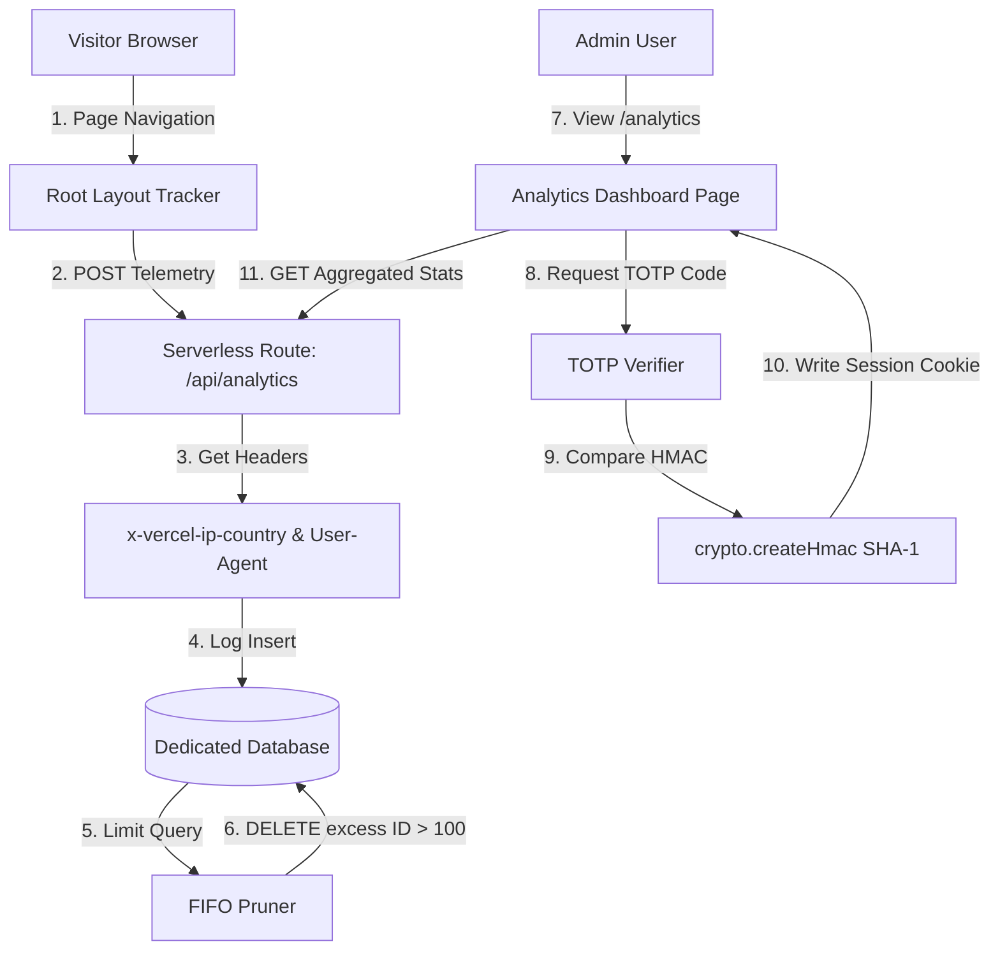

# Visitor Analytics Tracker & Dashboard

The **Visitor Analytics** module is a custom, lightweight, and secure traffic observer integrated directly into the parent portfolio shell. It logs page transitions, parses edge geolocations, enforces database limits to keep storage bounds within the free tier, and gates dashboard metrics using Time-based One-Time Passwords (TOTP).

---

## 🏗️ System Architecture

The following diagram visualizes the secure logging pipeline and TOTP authentication sequence:



---

## 🔒 Time-based One-Time Passcode (TOTP)

To protect visitor privacy and prevent public exposure of site traffic, the metrics dashboard is gated behind a 2FA challenge. The verification mechanism is self-contained and implemented using Node's native `crypto` module.

### Mathematical Algorithm
TOTP is calculated by hashing the current time window offset with a shared Base32 secret key using HMAC-SHA1:

\[\text{Time Window} = \left\lfloor \frac{\text{Epoch Time in Seconds}}{30} \right\rfloor\]

The verifier executes the following steps:
1. **Base32 Decoding**: Converts the 16-character base32 secret (e.g. `ANANDPORTFOLIOTP`) into a raw hex byte array.
2. **Time Window Encoding**: Converts the time window index into an 8-byte hex buffer representing the message parameter.
3. **HMAC-SHA1 Hash**: Calculates the HMAC signature:
   \[\text{Hash} = \text{HMAC-SHA1}(\text{Secret Key}, \text{Time Window Buffer})\]
4. **Dynamic Truncation**: Obtains a 4-byte offset dynamic slice from the hash output, extracts a 32-bit integer, and performs a modulo operations:
   \[\text{Code} = \text{Truncated Integer} \pmod{1,000,000}\]
5. **Clock Drift Tolerance**: Checks the user-entered token against the current time window, the previous window (\(-30\)s), and the next window (\(+30\)s) to prevent auth failures due to clock offsets.

---

## 🗄️ Database FIFO Pruning

To maintain a strict **$0/month** cost footprint and comply with database row limit guidelines, the system operates with a **100-row FIFO (First-In, First-Out) threshold**.

### SQL Schema
The data is housed in a separate, isolated database table:

```sql
CREATE TABLE IF NOT EXISTS visitor_logs (
    id SERIAL PRIMARY KEY,
    timestamp TIMESTAMPTZ DEFAULT NOW(),
    page_path TEXT NOT NULL,
    referrer TEXT,
    country TEXT,
    browser TEXT,
    os TEXT,
    session_id TEXT NOT NULL,
    load_time INT,
    ttfb INT,
    fcp INT
);
```

### Pruning Pipeline
On every incoming `POST` request to `/api/analytics`:
1. The serverless route inserts the new hit log.
2. The route fires a query to retrieve all log IDs ordered by timestamp descending:
   ```sql
   SELECT id FROM visitor_logs ORDER BY timestamp DESC;
   ```
3. If the returned record count is greater than 100, the server collects all IDs after index 100:
   ```javascript
   const excessIds = records.slice(100).map(r => r.id);
   ```
4. A single `DELETE` call removes the extra rows:
   ```sql
   DELETE FROM visitor_logs WHERE id IN (id1, id2, ...);
   ```

This architecture guarantees that the table is strictly capped at **exactly 100 rows**, maintaining database sizes under **20 Kilobytes** (less than 0.01% of free tiers).

---

## 📡 Telemetry & Speed Performance Gathering

* **Geolocating**: The serverless route avoids third-party location lookup APIs. Instead, it extracts the country code directly from Vercel's edge proxy request header: `x-vercel-ip-country`.
* **Client Handshake**: Page transitions are captured dynamically by rendering a client-side component `<AnalyticsTracker />` inside the root layout. It assigns a session ID inside the browser's `sessionStorage` to count unique visits without cookies or permanent trackers.
* **Performance Telemetry (Web Vitals)**: The tracker hooks into the browser's native **Performance Timing & Paint APIs** once the page reaches `document.readyState === "complete"`. It captures:
  * **Page Load Time**: The total document load and parse duration in milliseconds.
  * **TTFB (Time to First Byte)**: Server responsiveness (the difference between `responseStart` and `navigationStart`).
  * **FCP (First Contentful Paint)**: Initial rendering speed (captured via paint timeline entries for `first-contentful-paint`).

