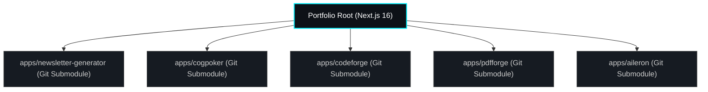

# Core Architecture & Engineering Patterns

This page serves as the master engineering design catalog for Anand's digital portfolio monorepo. It details the structural paradigms, GoF design patterns, serverless principles, and safety boundaries used to achieve high performance, infinite free-tier sustainability, and strict privacy.

---

## 1. Monorepo & Submodule System

The project is structured as a Next.js monorepo tracking 5 git submodules under the `apps/` directory. This allows each application to maintain its own decoupled Git history, packages, and environment settings, while the parent hub handles routing and overall layout consistency.



---

## 2. In-Depth Design Patterns

### Circuit Breaker & Row-Cap Middleware
* **Design Pattern**: Middleware Interceptor / Proxy Pattern.
* **Context**: Hosted cloud databases (like Supabase PostgreSQL free-tier) enforce strict storage quotas. A runaway recursive function or standard web crawler scraping can exhaust this quota in minutes, locking the database.
* **Mechanism**: The database wrapper intercepts all `log_trace` and `log_correction` inserts. Prior to executing the commit, the middleware counts the active rows. If thresholds are exceeded, it purges the oldest batch of records using a FIFO queue structure.
* **Mathematical Boundary**: 
  Let \(T_{count}\) be the active count of traces, and \(C_{count}\) the active count of feedback corrections. The middleware maintains:
  \[T_{count} \le 200 \quad \text{and} \quad C_{count} \le 50\]
  If \(T_{count} > 200\), the database executes:
  ```sql
  DELETE FROM aileron_traces 
  WHERE id IN (
      SELECT id FROM aileron_traces 
      ORDER BY created_at ASC 
      LIMIT 10
  );
  ```

---

### Self-Healing Active Presence
* **Design Pattern**: State Observer & Self-Healing Loop.
* **Context**: Collaborative tools running on WebSockets (Supabase Realtime) can lose connection during network changes (switching Wi-Fi, browser tabs sleeping). Stale estimator client profiles remain stuck, disrupting size voting.
* **Reconciliation Loop**: 
  Every client runs a continuous timer checks (`setInterval` running every 200ms). The client reconciles its locally tracked vote and player status against the server-side presence broadcast array. If the local state is missing from the server array, it executes an immediate self-healing track payload:
  
```javascript
// Verification & Self-Healing Trigger
const serverPresenceArray = presenceState[myUserId];
const myServerPresence = serverPresenceArray?.[serverPresenceArray.length - 1];

if (!myServerPresence || myServerPresence.voteCast !== localState.voteCast) {
  console.warn("Presence divergence detected. Forcing self-healing track...");
  channel.track(localState);
}
```

---

### Stateless GZIP Deflate URL Serialization
* **Design Pattern**: Pipe and Filter / Flyweight.
* **Context**: Sharing code formatting configs and diff checks traditionally requires storing payloads in an online database, resulting in storage costs and latency.
* **Transformation Pipeline**:
  To achieve database-free share links, CodeForge pipes editor contents through a client-side GZIP deflate stream:
  ```
  [Raw JSON Code String]
         │
         ▼ (TextEncoder)
  [UTF-8 Binary Uint8Array]
         │
         ▼ (Piped into CompressionStream)
  [Deflated Binary Buffer]
         │
         ▼ (Base64 URL-Safe Conversion)
  [URL Safe Base64 String] -> Written to location.hash
  ```
* **Decompression on Load**: Reading the hash invokes a mirror pipeline: `location.hash -> ArrayBuffer -> DecompressionStream('deflate') -> TextDecoder -> JSON -> Monaco Panel`.

---

### Client-Side Browser Sandboxing
* **Design Pattern**: Client Sandbox Delegation / Proxy.
* **Context**: Uploading files to server-side routes for text parsing or merging introduces security compliance issues, memory limitations, and increased hosting overhead.
* **Solution**: By shipping libraries (`PDF.js` and `PDF-Lib`) directly to the client browser thread, all file reads, rendering, splits, and compilation occur within WebAssembly/Blob memory inside the browser sandbox. The server only proxies stateless API completions to OpenRouter, maintaining absolute privacy.

---

## 3. Serverless Edge Principles

Operating within Vercel's global CDN Edge dictates key architectural design choices:
* **Stateless API Gateway**: Next.js API routes hide sensitive developer API keys (OpenRouter/Gemini keys) from client inspectors, executing under 100ms.
* **Cascade Failovers**: Network failures or rate limits automatically trigger local code paths, keeping interfaces active.
